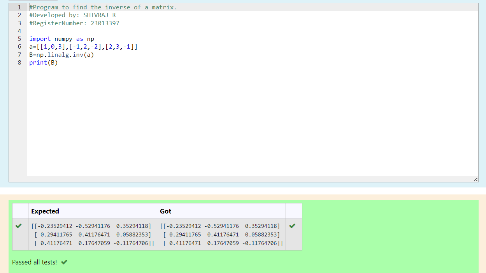

# INVERSE-OF-A-MATRIX
## Aim:
To write a python program to find the inverse of a matrix
## Equipment’s required:
1. 	Hardware – PCs
2. 	Anaconda – Python 3.7 Installation / Moodle-Code Runner
## Algorithm:
### Step 1:
Start the program

### Step 2: 
Assign the value to 'a'

### Step 3: 
Print the inverse of 'a'

### Step 4: 
Stop the program

## Program:
#Program to find the inverse of a matrix.
#Developed by: SHIVRAJ R
#RegisterNumber: 23013397

import numpy as np
a=[[1,0,3],[-1,2,-2],[2,3,-1]]
B=np.linalg.inv(a)
print(B)

## Output:

## Result:
Thus the inverse of given matrix is successfully solved using python program

